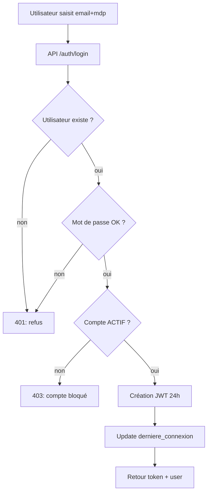
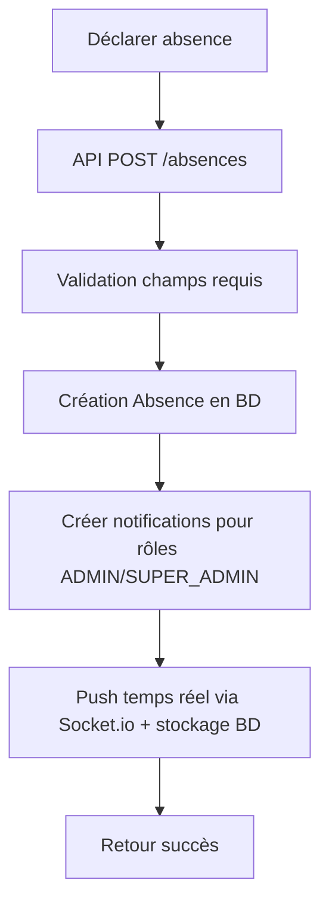

# Modèles & Diagrammes — GRH-CARSO

Ce document regroupe les modèles demandés pour le projet **GRH-CARSO** :
- **Modèles de données**: MCD (conceptuel), MLD (logique), dictionnaire de données
- **Modèles de traitements**: MCT (conceptuel de traitement), workflows, DFD (flux de données)
- **Liste des modèles existants**: modèles Prisma (tables) + enums

> Remarque: les diagrammes ci-dessous sont fournis au format **Mermaid** afin d’être facilement rendus dans Markdown (GitHub, VS Code, etc.).

---

## 1) Modèles existants dans le projet (Prisma)

Source: `backend/prisma/schema.prisma`

### 1.1 Enums (domaines)

- **StatutUtilisateur**: `ACTIF`, `BLOQUE`
- **RoleUtilisateur**: `SUPER_ADMIN`, `ADMIN`, `EMPLOYE`
- **StatutContrat**: `ACTIF`, `TERMINE`
- **StatutPresence**: `PRESENT`, `ABSENT`, `RETARD`
- **StatutConge**: `SOUMIS`, `APPROUVE`, `REJETE`
- **StatutPaiement**: `EFFECTUE`, `EN_ATTENTE`, `ANNULE`

### 1.2 Modèles (tables)

- `Utilisateur`
- `Employe`
- `Departement`
- `Poste`
- `Contrat`
- `Absence`
- `Presence`
- `Conge`
- `Notification`
- `SuiviPerformance`
- `Paiement`
- `BulletinSalaire`

---

## 2) MCD — Modèle Conceptuel de Données (ER)

### 2.1 Diagramme ER (Mermaid)

```mermaid
erDiagram
  UTILISATEUR {
    int id PK
    string nom_utilisateur UK
    string prenom_utilisateur
    string email UK
    string mot_de_passe
    string role
    string statut
    datetime date_creation
    datetime derniere_connexion
    bool premiere_connexion
    string token_reset_password UK
    datetime token_expiration
    string avatar
    string photo_couverture
    string bio
    string telephone
    datetime date_naissance
    string adresse
    string ville
    string pays
    int employeId UK_FK
  }

  EMPLOYE {
    int id PK
    string matricule UK
    string nom
    string prenom
    datetime date_naissance
    string adresse
    string email UK
    string telephone
    datetime date_embauche
    int departementId FK
    int posteId FK
  }

  DEPARTEMENT {
    int id PK
    string nom_departement UK
    string responsable
  }

  POSTE {
    int id PK
    string intitule
    string description
    string niveau
  }

  CONTRAT {
    int id PK
    string type_contrat
    datetime date_debut
    datetime date_fin
    float salaire_base
    string statut
    int employeId UK_FK
  }

  PRESENCE {
    int id PK
    datetime date_jour
    string statut
    int heures_travaillees
    string justification
    int employeId FK
  }

  ABSENCE {
    int id PK
    datetime date_debut
    datetime date_fin
    string type_absence
    string justification
    string piece_jointe
    int employeId FK
  }

  CONGE {
    int id PK
    string type_conge
    datetime date_debut
    datetime date_fin
    string statut
    string motif
    int duree_jours
    int utilisateurId FK
    int employeId FK
  }

  PAIEMENT {
    int id PK
    datetime date_paiement
    float montant
    string mode_paiement
    string statut
    datetime periode_debut
    datetime periode_fin
    int employeId FK
  }

  BULLETIN_SALAIRE {
    int id PK
    int mois
    int annee
    float salaire_brut
    float salaire_net
    string statut
    int paiementId UK_FK
  }

  SUIVI_PERFORMANCE {
    int id PK
    datetime date_eval
    int note
    string resultat
    string commentaires
    string objectifs
    string realisation
    int employeId FK
  }

  NOTIFICATION {
    int id PK
    string titre
    string message
    string type
    string categorie
    bool lue
    datetime date_creation
    datetime date_lue
    json metadata
    int utilisateurId FK
  }

  DEPARTEMENT ||--o{ EMPLOYE : "contient"
  POSTE ||--o{ EMPLOYE : "occupe"
  EMPLOYE ||--o{ PRESENCE : "a"
  EMPLOYE ||--o{ ABSENCE : "a"
  EMPLOYE ||--o{ CONGE : "demande"
  UTILISATEUR ||--o{ CONGE : "soumet"
  EMPLOYE ||--o{ PAIEMENT : "recoit"
  PAIEMENT ||--o| BULLETIN_SALAIRE : "genere"
  EMPLOYE ||--o{ SUIVI_PERFORMANCE : "est_evalue"
  UTILISATEUR ||--o{ NOTIFICATION : "recoit"
  EMPLOYE ||--o| CONTRAT : "a"
  EMPLOYE ||--o| UTILISATEUR : "possede_compte"
```

### 2.2 Contraintes conceptuelles (règles de gestion)

- **Utilisateur ↔ Employe**: association 0..1 ↔ 0..1 (un employé peut avoir un compte; un compte peut être lié à un employé).
- **Contrat**: contrainte 0..1 contrat par employé (clé unique `employeId` côté contrat).
- **BulletinSalaire**: contrainte 0..1 bulletin par paiement (clé unique `paiementId`).
- **Conge**: lié à un **employé** et à un **utilisateur** (traçabilité: qui a soumis la demande).

---

## 3) MLD — Modèle Logique de Données (relationnel)

> Notation: **TABLE**(PK, attributs…, FK→Table).

- **utilisateurs**(id PK, nom_utilisateur UK, prenom_utilisateur, email UK, mot_de_passe, role, statut, date_creation, derniere_connexion, premiere_connexion, mot_de_passe_temporaire, token_reset_password UK, token_expiration, avatar, photo_couverture, bio, telephone, date_naissance, adresse, ville, pays, employeId UK FK→Employe.id)
- **Employe**(id PK, matricule UK, nom, prenom, date_naissance, adresse, email UK, telephone, date_embauche, departementId FK→Departement.id, posteId FK→Poste.id)
- **Departement**(id PK, nom_departement UK, responsable)
- **Poste**(id PK, intitule, description, niveau)
- **Contrat**(id PK, type_contrat, date_debut, date_fin, salaire_base, statut, employeId UK FK→Employe.id)
- **Presence**(id PK, date_jour, statut, heures_travaillees, justification, employeId FK→Employe.id)
- **Absence**(id PK, date_debut, date_fin, type_absence, justification, piece_jointe, employeId FK→Employe.id)
- **Conge**(id PK, type_conge, date_debut, date_fin, statut, motif, duree_jours, utilisateurId FK→utilisateurs.id, employeId FK→Employe.id)
- **Paiement**(id PK, date_paiement, montant, mode_paiement, statut, periode_debut, periode_fin, employeId FK→Employe.id)
- **BulletinSalaire**(id PK, mois, annee, salaire_brut, salaire_net, statut, paiementId UK FK→Paiement.id)
- **SuiviPerformance**(id PK, date_eval, note, resultat, commentaires, objectifs, realisation, employeId FK→Employe.id)
- **notifications**(id PK, titre, message, type, categorie, lue, date_creation, date_lue, metadata, utilisateurId FK→utilisateurs.id)

---

## 4) Dictionnaire de données (principaux attributs)

> Le dictionnaire ci-dessous décrit les champs **tels qu’implémentés** par Prisma, avec une description fonctionnelle.

### 4.1 `Utilisateur` (table mappée: `utilisateurs`)

- **id** (Int, PK): identifiant interne.
- **nom_utilisateur** (String, UK): identifiant fonctionnel de connexion (pseudo).
- **prenom_utilisateur** (String?, optionnel): prénom.
- **email** (String, UK): email de connexion/communication.
- **mot_de_passe** (String): hash du mot de passe (bcrypt).
- **role** (RoleUtilisateur): SUPER_ADMIN / ADMIN / EMPLOYE.
- **statut** (StatutUtilisateur): ACTIF / BLOQUE.
- **date_creation** (DateTime): date d’inscription.
- **derniere_connexion** (DateTime?, optionnel): dernière connexion.
- **premiere_connexion** (Boolean): impose changement MDP au 1er login.
- **mot_de_passe_temporaire** (String?, optionnel): MDP temporaire (si utilisé).
- **token_reset_password** (String?, UK): token reset mot de passe.
- **token_expiration** (DateTime?, optionnel): expiration du token reset.
- **avatar** (String?, optionnel): url/base64 avatar.
- **photo_couverture** (String?, défaut hex): couleur de couverture.
- **bio** (Text?, optionnel): biographie.
- **telephone** (String?, optionnel): téléphone.
- **date_naissance** (DateTime?, optionnel): date naissance.
- **adresse/ville/pays**: localisation.
- **employeId** (Int?, UK, FK): lien vers employé.

### 4.2 `Employe`

- **id** (Int, PK)
- **matricule** (String, UK): code employé.
- **nom / prenom** (String): identité.
- **date_naissance** (DateTime)
- **adresse/email/telephone**: contact.
- **date_embauche** (DateTime): point de départ pour calculs (solde congés, ancienneté).
- **departementId** (Int?, FK): rattachement.
- **posteId** (Int?, FK): poste.

### 4.3 `Departement`

- **id** (Int, PK)
- **nom_departement** (String, UK)
- **responsable** (String?, optionnel)

### 4.4 `Poste`

- **id** (Int, PK)
- **intitule** (String)
- **description** (String?, optionnel)
- **niveau** (String?, optionnel)

### 4.5 `Contrat`

- **id** (Int, PK)
- **type_contrat** (String): CDI, CDD, etc.
- **date_debut / date_fin** (DateTime, DateTime?): bornes.
- **salaire_base** (Float)
- **statut** (StatutContrat)
- **employeId** (Int, UK, FK): 1 contrat max par employé.

### 4.6 `Presence`

- **id** (Int, PK)
- **date_jour** (DateTime, défaut now)
- **statut** (StatutPresence): PRESENT/ABSENT/RETARD
- **heures_travaillees** (Int?, optionnel)
- **justification** (String?, optionnel)
- **employeId** (Int, FK)

### 4.7 `Absence`

- **id** (Int, PK)
- **date_debut / date_fin** (DateTime): période.
- **type_absence** (String)
- **justification** (String?, optionnel)
- **piece_jointe** (String?, optionnel): preuve (url).
- **employeId** (Int, FK)

### 4.8 `Conge`

- **id** (Int, PK)
- **type_conge** (String?, optionnel): annuel, maladie, RTT, etc.
- **date_debut / date_fin** (DateTime)
- **statut** (StatutConge): SOUMIS/APPROUVE/REJETE
- **motif** (String?, optionnel)
- **duree_jours** (Int?, optionnel): durée calculée.
- **utilisateurId** (Int, FK): qui a soumis.
- **employeId** (Int, FK): bénéficiaire.

### 4.9 `Paiement` / `BulletinSalaire`

**Paiement**
- **id** (Int, PK)
- **date_paiement** (DateTime, défaut now)
- **montant** (Float)
- **mode_paiement** (String)
- **statut** (StatutPaiement)
- **periode_debut / periode_fin** (DateTime): période payée.
- **employeId** (Int, FK)

**BulletinSalaire**
- **id** (Int, PK)
- **mois / annee** (Int)
- **salaire_brut / salaire_net** (Float)
- **statut** (String, défaut “valide”)
- **paiementId** (Int, UK, FK): 1 bulletin max par paiement.

### 4.10 `SuiviPerformance`

- **id** (Int, PK)
- **date_eval** (DateTime, défaut now)
- **note** (Int)
- **resultat/commentaires/objectifs/realisation** (String?, optionnels)
- **employeId** (Int, FK)

### 4.11 `Notification` (table mappée: `notifications`)

- **id** (Int, PK)
- **titre** (String)
- **message** (String)
- **type** (String, défaut “info”): info/success/warning/error
- **categorie** (String?, optionnel): conge/absence/presence/…
- **lue** (Boolean, défaut false)
- **date_creation** (DateTime, défaut now)
- **date_lue** (DateTime?, optionnel)
- **metadata** (Json?, optionnel): lien vers entité (entityId, etc.)
- **utilisateurId** (Int, FK): destinataire

---

## 5) MCT — Modèle Conceptuel de Traitement (processus)

### 5.1 Processus P1 — Authentification (login) + session

**Acteurs**: Utilisateur (SuperAdmin/Admin/Employé), API, BD  
**Entrées**: email, mot_de_passe  
**Sorties**: JWT + profil utilisateur, mise à jour `derniere_connexion`



### 5.2 Processus P2 — Déclaration d’absence

**Acteurs**: Employé / Admin, API, BD, Module notifications  
**Résultat**: création `Absence` + notification aux Admin/SuperAdmin.



### 5.3 Processus P3 — Pointage présence

**Acteurs**: Employé / Admin, API, BD, notifications  
**Résultat**: création `Presence` + notification aux Admin/SuperAdmin.

### 5.4 Processus P4 — Demande de congé (avec règles)

**Acteurs**: Employé, API, BD  
**Résultat**: création `Conge` (SOUMIS) + notification aux Admin/SuperAdmin.

```mermaid
flowchart TD
  A[Employé demande congé] --> B[API POST /conges]
  B --> C[Contrôles: utilisateurId+employeId existent]
  C --> D[Calcul durée (jours calendaires)]
  D --> E[Calcul solde (prorata + report)]
  E --> F[Validation règles (max, limites, chevauchement)]
  F -- invalide --> G[Erreur + message métier]
  F -- valide --> H[Créer congé statut SOUMIS]
  H --> I[Notifier ADMIN/SUPER_ADMIN]
  I --> J[Retour succès]
```

### 5.5 Processus P5 — Validation/Rejet congé

**Acteurs**: Admin/SuperAdmin, API, BD, notifications  
**Résultat**: mise à jour `Conge.statut` + notification à l’employé.

### 5.6 Processus P6 — Paiement + bulletin

**Acteurs**: Admin/SuperAdmin, API, BD  
**Résultat**: création `Paiement` (+ éventuellement génération `BulletinSalaire` selon implémentation).

---

## 6) DFD — Diagrammes de Flux de Données

### 6.1 DFD Niveau 0 (Contexte)

```mermaid
flowchart LR
  U[Utilisateur\n(SUPER_ADMIN/ADMIN/EMPLOYE)] -->|Requêtes UI| S[GRH-CARSO]
  S -->|Réponses + notifications| U
  S <--> DB[(Base PostgreSQL)]
  S <--> IO[Socket.io\n(temps réel)]
  S --> CL[Cloudinary\n(uploads avatar/fichiers)]
```

### 6.2 DFD Niveau 1 (fonctions principales)

```mermaid
flowchart TB
  U[Utilisateur] --> P1[1. Authentification]
  U --> P2[2. Gestion RH\n(employés, postes, départements)]
  U --> P3[3. Temps & Absences\n(présences, absences)]
  U --> P4[4. Congés]
  U --> P5[5. Paie\n(paiements, bulletins)]
  U --> P6[6. Performances]
  U --> P7[7. Notifications]

  P1 <--> DB[(PostgreSQL)]
  P2 <--> DB
  P3 <--> DB
  P4 <--> DB
  P5 <--> DB
  P6 <--> DB
  P7 <--> DB

  P7 <--> IO[Socket.io]
  P2 --> CL[Cloudinary]
```

---

## 7) Catalogue “modèles” supplémentaires (règles / permissions / API)

### 7.1 Modèle des permissions (frontend)

Source: `frontend/src/config/permissions.js`

- Les permissions sont définies **par module** (`utilisateurs`, `employes`, `conges`, etc.)
- Chaque module porte des droits: `view`, `create`, `edit`, `delete` + parfois `viewOwn`, `declare`, `pointer`.

### 7.2 Modèle des API (routes REST)

Source: `backend/src/routes/*.js` (extrait)

- **Employés**: `POST /api/employes`, `GET /api/employes`, `GET /api/employes/:id`, `PUT /api/employes/:id`, `DELETE /api/employes/:id`, `PATCH /api/employes/:id/desactiver`
- **Congés**: `POST /api/conges`, `GET /api/conges`, `GET /api/conges/:id`, `GET /api/conges/solde/:employeId`, `PUT /api/conges/:id`, `DELETE /api/conges/:id`
- **Présences**: `POST /api/presences`, `GET /api/presences`, `GET /api/presences/:id`, `PUT /api/presences/:id`, `DELETE /api/presences/:id`
- **Absences**: `POST /api/absences`, `GET /api/absences`, `GET /api/absences/:id`, `PUT /api/absences/:id`, `DELETE /api/absences/:id`
- **Paiements**: `POST /api/paiements`, `GET /api/paiements`, `GET /api/paiements/:id`, `PUT /api/paiements/:id`, `DELETE /api/paiements/:id`
- **Bulletins**: `POST /api/bulletins`, `GET /api/bulletins`, `GET /api/bulletins/:id`, `PUT /api/bulletins/:id`, `DELETE /api/bulletins/:id`
- **Performances**: `POST /api/performances`, `GET /api/performances`, `GET /api/performances/:id`, `PUT /api/performances/:id`, `DELETE /api/performances/:id`
- **Départements**: `POST /api/departements`, `GET /api/departements`, `GET /api/departements/:id`, `PUT /api/departements/:id`, `DELETE /api/departements/:id`
- **Postes**: `POST /api/postes`, `GET /api/postes`, `GET /api/postes/:id`, `PUT /api/postes/:id`, `DELETE /api/postes/:id`
- **Notifications**: `GET /api/notifications`, `PATCH /api/notifications/read-all`, `PATCH /api/notifications/:id/read`, `DELETE /api/notifications/:id`
- **Upload**: `POST /api/upload/avatar`, `DELETE /api/upload/avatar/:publicId`

---

## 8) Annexes (à compléter si tu veux “tous les modèles” au sens UML)

Si ton établissement exige aussi des UML, je peux te générer en plus :
- **Diagramme de cas d’utilisation** (Use Case)
- **Diagrammes de séquence** (ex: demande de congé, validation, notification)
- **Diagramme d’activités**
- **Diagramme de classes** (aligné sur Prisma)

